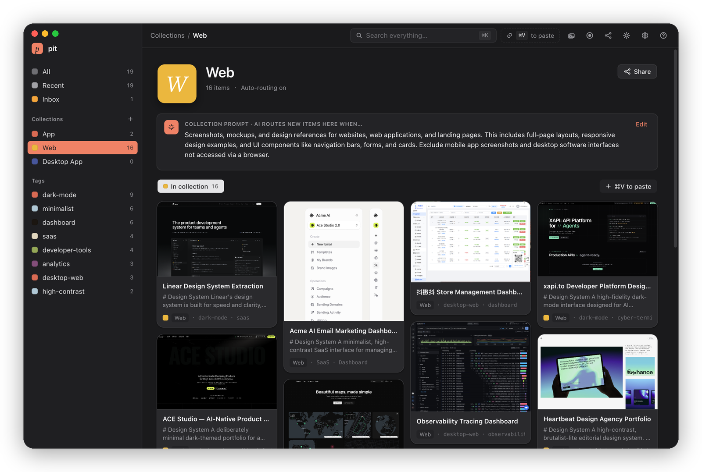

# pit

<p align="center">
  
</p>

**A design-reference brain for people who build interfaces.** Capture anything that
inspires you — a website, a screenshot, a tweet, a 小红书 note, a screen recording —
and pit uses AI to read its _design_ (palette, type, components, layout, motion) into
a structured `DESIGN.md`, then files it into the right collection automatically. It's a
local-first Electron app: your library lives on your machine.

> **Where it's going:** a personal, queryable design system of record. Your scattered
> references become reusable design knowledge — searchable, remixable, shareable, and
> readable by agents through a built-in [MCP](https://modelcontextprotocol.io) server.

## Download

Grab the latest build from [Releases](https://github.com/dxiongya/pit/releases):

| OS      | File                                                       |
| ------- | ---------------------------------------------------------- |
| macOS   | `pit-<version>.dmg` — open it, drag **pit** to Applications |
| Windows | `pit-<version>-setup.exe`                                  |
| Linux   | `pit-<version>.AppImage` (`chmod +x` & run) or the `.deb`   |

> Builds are currently **unsigned**. First launch on macOS needs a right-click →
> **Open** (or `xattr -cr /Applications/pit.app`) to clear Gatekeeper; on Windows,
> pick **More info → Run anyway** at the SmartScreen prompt.

## Getting started

1. **Add an AI key (once).** Open **Settings → AI** and add a provider — Anthropic,
   OpenAI, Google, or any OpenAI-compatible endpoint (Ollama, vLLM…). Without a key pit
   still captures and stores everything; the design analysis just falls back to a sample
   (marked with a _Sample_ badge) until a key is set.
2. **Capture anything — just paste.** Press **⌘V** anywhere to paste a link or image, or
   drag files in. pit handles full web pages (full-page capture **plus** source-level
   palette / type / tech), X &amp; 小红书 posts, image sets, and screen recordings — you
   can even paste a whole share blob copied from an app and pit pulls the link out of it.
3. **Let AI read it.** Each item becomes a `DESIGN.md` — theme, palette &amp; roles,
   typography, components, layout/IA, motion, do/don'ts, a11y, and an "apply this style"
   agent prompt — grounded in the page's real DOM/CSS, not guessed from a screenshot.
4. **Collections that file themselves.** Create a collection and give it a plain-language
   **prompt** (e.g. "dark, dense analytics dashboards"). New items auto-route to where
   they belong; the builder previews what would land there before you save. Anything
   uncategorized waits in **Inbox**.
5. **Share a curated set.** Share a single item or a **hand-picked subset** of a
   collection as one public link — live preview, optional password, expiry. Free
   `pit.ink` links cap at 50 MB / 1 hour; self-host the Cloudflare Worker
   (Settings → Sharing) for no limits.

> Tip: **⌘K** opens command search, and the **?** in the top bar reopens this tour any time.

## Features

### Capture anything

- **Paste or drag** — `⌘V` or drag links, images, and videos in. pit detects the
  type and even **pulls the link out of a whole copied share blob** (e.g. an X or
  小红书 "share to…" message, not just a bare URL).
- **Full-page website capture** — loads the page in a hidden window, dismisses
  cookie/consent overlays, scrolls to trigger lazy content, and slices tall pages
  into vision-safe segments via CDP.
- **Source-level design harvest** — reads the _real_ design straight from the live
  DOM/CSS: a quantized color palette, font families/sizes/weights, CSS
  custom-property tokens, framework (React / Next / Vue / Svelte) + CSS-method
  (Tailwind / styled-components / emotion) detection, and the logo SVG.
- **Special sources** — first-class extractors for **X / Twitter** (text, author,
  media) and **小红书 / Xiaohongshu** notes, with login-wall detection.
- **Video & screen recording** — drop a video to auto-extract de-duplicated
  keyframes (+ motion analysis), or use the built-in **screen recorder** (toolbar,
  pause/resume, region picker) to capture UI flows straight into the library.
- **Image groups** — combine related shots (variants, a flow, a moodboard) into one
  item for batched analysis that finds the shared design language (up to 12).

### AI that reads design

- **DESIGN.md** — every item becomes a structured doc: theme, palette & roles,
  typography, components, layout/IA, motion, accessibility, do/don'ts, plus a
  _replica_ and an _apply-this-style_ agent prompt — grounded in the page's real
  source, not guessed from a screenshot.
- **Multi-provider** — Anthropic, OpenAI, Google, or any OpenAI-compatible endpoint
  (Ollama, vLLM…), switchable per role. No key? pit still captures everything;
  analysis falls back to a clearly-marked _Sample_ until you add one.
- **Derive variants** — generate color/content variations of an analyzed design as
  interactive HTML, saved alongside the original.

### Organize without filing

- **Collections that route themselves** — give a collection a plain-language
  **prompt**; new items auto-route to the best match, with a live preview before you
  save. Uncategorized items wait in **Inbox**.
- **Find fast** — `⌘K` command palette + kind filters (sites / images / palettes /
  fonts / …).

### Share & hand off

- **One link, just the good parts** — share a single item or a **hand-picked
  subset** of a collection; optional password + expiry; live preview. Free
  **pit.ink** links, or self-host the Cloudflare Worker for no limits.
- **Readable by agents** — a built-in **MCP server** (stdio + HTTP) exposes your
  library read-only to Claude and other agents.

### Thoughtful by default

First-run **onboarding tour** (reopen via the **?** in the top bar), light/dark +
accent/density theming, `pit://` deep links, and an **SSRF guard** that refuses to
fetch internal/loopback addresses from pasted URLs.

## Architecture

```
src/
  main/                      Electron main process
    index.ts                 Window (hiddenInset titlebar), full IPC registry,
                             pit:// deep links, single-instance, drag-out
    settings.ts              Durable settings (JSON in userData)
    db.ts                    SQLite (better-sqlite3) — items + collections
    ai.ts                    Real provider client: Anthropic / OpenAI / Google /
                             OpenAI-compatible — analyze site|image|video, route,
                             collection-description (streaming + JSON output)
    capture.ts               Offscreen BrowserWindow + CDP full-page screenshots
    derive.ts                Palette-shift + AI-generated HTML variants → thumbnail
    share.ts                 Upload/fetch shares to the Cloudflare Worker
    video.ts                 ffmpeg keyframe extraction (deduped frames)
    recorder-windows.ts      Multi-window screen recorder (toolbar/control/region)
    mcp.ts                   Install/uninstall/test the standalone MCP server
    net-guard.ts             SSRF guard for renderer-supplied URLs
    link-handlers/           Pluggable extractors: registry, twitter, xhs, generic
  preload/
    index.ts                 window.pit bridge — full typed IPC surface + streaming
  shared/
    ipc.ts                   Types shared across main / preload / renderer
  renderer/src/
    App.tsx                  Window shell + router + overlays
    styles/                  app.css design system + recorder.css
    lib/
      types.ts               Data model incl. the DESIGN.md schema
      store.tsx              App state (settings/collections/items) + persistence
      ai/provider.ts         Role→provider capability layer over the IPC bridge
      ai/brands.tsx          Provider preset metadata + logos
      catalog/               Generated AI-model catalog (vendors, modalities)
      icons.tsx, mockData.ts, aiText.ts, shareHistory.ts
    components/              Sidebar, TopBar, Masonry, CommandPalette, Toast,
                             RoutingRow, ui/ (Base UI primitives)
    views/                   HomeView, CollectionView, NewCollectionView,
                             SettingsView, detail/* (Link/Image/Video/Analyzing,
                             Share/Receive/Derive/GroupImport modals, Lightbox…)
    recorder/               In-renderer recorder UI (toolbar/control/region)

infra/                       Cloud (optional, for Share + MCP)
  cf-worker/                 Cloudflare Worker share API (D1 + R2)
  cf-pages/                  Public share viewer (pit.ink/p/:code)
  mcp-server/                MCP server (stdio + Streamable HTTP) — library read-only to agents
```

### The AI / capture seam

`lib/ai/provider.ts` is the single seam between the UI and AI. It resolves each
functional role (`design` / `derive` / `routing`) to a concrete provider + model
and dispatches over the `window.pit` bridge to `src/main/ai.ts`, which makes the
real HTTP calls (Anthropic / OpenAI / Google / any OpenAI-compatible endpoint),
streaming structured `DESIGN.md` JSON back on a per-call channel. Adding a vendor
is a new branch in `ai.ts`; adding a link source is a new entry in the
`link-handlers` registry.

The mock `DesignDoc` / offline routing heuristic in `provider.ts` is **only** a
degraded fallback — it triggers when no provider is configured or a call errors,
not as the default. Settings and the library persist for real (settings JSON via
`pit:get-settings`/`set-settings` with a `localStorage` fallback; items and
collections in SQLite via `pit:items:*` / `pit:collections:*`).

## Project Setup

```bash
pnpm install
pnpm dev        # run the app
pnpm build      # typecheck + bundle main/preload/renderer
pnpm typecheck  # tsc for node + web
pnpm lint       # eslint
pnpm build:mac  # package (also build:win / build:linux)
```
